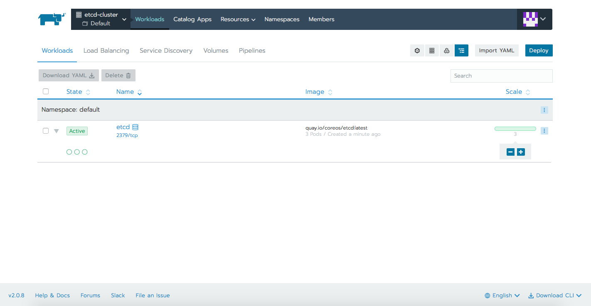

## Introduction

Etcd is an open-source distributed key-value store created by [CoreOS](https://coreos.com) team and moved now to the Cloud Native Computing Foundation. It is pronounced "et-cee-dee", making reference to distributing the Unix "/etc" directory, where lots of configuration files live, across multiple machines. It serves as the backbone of distributed systems providing a reliable way for storing data across a cluster of servers. It works on a variety of operating systems including here Linux, BSD and OS X.

## About etcd and its focus:
- fully replicated: entire store is available at every location in the network
- highly available: designed to avoid single points of failure in case of hardware or network issues
- consistent: every read returns the most recent write across multiple hosts
- Simple: well-defined, user-facing API (gRPC)
- Secure: automatic TLS with optional client cert authentication
- Fast: benchmarked 10,000 writes/sec
- Reliable: properly distributed using [Raft](https://raft.github.io/raft.pdf)

## How does it work?
- Three key concepts: leader, elections, terms. The cluster `elects` a leader for a given `term`. All changes are decided by the leader and then updates are pushed to the followers. If a leader is killed the cluster is the one to decide the new leader.
- Raft consensus algorithm: the leader handles all client requests which need cluster consensus. Requests not requiring consensus are processed by any cluster member. Raft is an algorithm for multiple nodes to maintain identical logs of state changing commands. Nodes coordinate with each other to agree on which order state changes happen in. For any action there has to be quorum which is decided by (N/2)+1, with N being the number of nodes, or voting members of the distributed system. If it receives greater than 50% of the votes then the action is allowed to take place. In this case, the action is written to a log on each node which is the source of truth. To learn more about raft you can visit [https://raft.github.io](https://raft.github.io).

## Etcd used by Kubernetes
Since its adoption as part of Kubernetes in 2014 the community has grown exponentially. There are lots of contributing members numbering CoreOS, Google, Redhat, IBM, Cisco, Huawei and more. It is successfully used in production environments by large cloud providers such as AWS, Google Cloud Platform, Azure.
Etcd's job is to safely store critical data for distributed systems. It's best known as Kubernetes' primary datastore, being used for storing its configuration data, its state, and its metadata. As we know, Kubernetes runs on several machines at the same time. Being a distributed system, it needs a distributed data store like etcd. Etcd makes it easy to store data across a cluster and watch for changes, allowing any node from Kukernetes cluster to read and write data. Etcd's `watch` functionality is used by Kubernetes to monitor changes to either the `actual` or the `desired` state of its system. If they are different, Kubernetes makes changes to reconcile the two states. Every read the kubectl retrieves is stored in etcd, any change made (kubectl apply) will create or update an entry in etcd, every crash will trigger a value change in etcd.

## Deployment and hardware recommendations
For testing or development purposes etcd can run on a laptop or a light cloud setup. However, when running etcd clusters in production, we should take in consideration the guidelines offered by etcd official documentation [page](https://github.com/etcd-io/etcd/blob/master/Documentation/op-guide/hardware.md). The page offers a good starting point for a robust production deployment. Things to keep in mind:
- since etcd writes data to disk, SSD is highly recommended
- odd number of cluster members as quorum is needed to agree on updates to the cluster state 
- cluster size should not have more than 7 nodes (although theoretically there is no hard limit).

Let's see what are the steps to deploy an etcd cluster in [Kubernetes](https://kubernetes.io/docs/concepts/overview/what-is-kubernetes/) and then check some basic CLI commands or API calls. We need a combination of few Kubernetes’ key concepts like [StatefulSets](https://kubernetes.io/docs/concepts/workloads/controllers/statefulset/) and [PersistentVolumes](https://kubernetes.io/docs/concepts/storage/persistent-volumes/).

### Prerequisites
To perform this demo you will need the following:
- a Google Cloud Platform account, the free tier provided is more than enough (any other cloud should work the same)
- [Rancher](https://rancher.com)
- Kubernetes cluster running on Google Kubernetes Engine (running EKS or AKS should be the same)

### Starting a Rancher 2.0 instance
To begin, start a Rancher 2.0 instance. There is a very intuitive getting started guide for this purpose [here](https://rancher.com/quick-start/).

### Using Rancher to deploy a GKE cluster
Use Rancher to set up and configure your Kubernetes cluster, follow the how-to [guide](https://rancher.com/docs/rancher/v2.x/en/cluster-provisioning/hosted-kubernetes-clusters/gke/).

We will need a VM (can be the same with the one hosting our Rancher instance) with `Google Cloud SDK` and `kubelet` installed. Make sure that gcloud has access to the Cloud Platform with Google user credentials (`gcloud init` and `gcloud auth login`).
As soon as cluster is deployed, we can check basic kubectl commands.

```bash
$ kubectl get nodes
NAME                                     STATUS   ROLES    AGE   VERSION
gke-c-ggchf-default-pool-df0bc935-31mv   Ready    <none>   48s   v1.11.6-gke.2
gke-c-ggchf-default-pool-df0bc935-ddl5   Ready    <none>   48s   v1.11.6-gke.2
gke-c-ggchf-default-pool-df0bc935-qqhx   Ready    <none>   48s   v1.11.6-gke.2
```

Before deploying the etcd cluster (using `kubectl` or importing yamls in Rancher's UI) we need few configurations. In GCE the default persistent disk is `pd-standard`. We will need to configure `pd-ssd` for our etcd deployment. This is not mandatory, but as per etcd recommendations, SSD is very good option. Please check this [page](https://kubernetes.io/docs/concepts/storage/storage-classes/) for other cloud providers' storage classes.

Let's check the available storage class which GCE offers. We will see the default one, called `standard`.
```bash
$ kubectl get storageclass
NAME                 PROVISIONER            AGE
standard (default)   kubernetes.io/gce-pd   2m
```

Let's apply this yaml (please update the zone accordingly) so we can benefit of SSD storage.

storage-class.yaml:
```yaml
---
kind: StorageClass
apiVersion: storage.k8s.io/v1
metadata:
  name: ssd
provisioner: kubernetes.io/gce-pd
parameters:
  type: pd-ssd
  zone: europe-west4-c
```

We can see now that ssd, along the default standard class is available.
```
$ kubectl apply -f storage-class.yaml 
storageclass.storage.k8s.io/ssd created

$ kubectl get storageclass
NAME                 PROVISIONER            AGE
ssd                  kubernetes.io/gce-pd   7s
standard (default)   kubernetes.io/gce-pd   4m
```


We can now proceed with deploying the etcd cluster. We will be having a StatefulSet deployment with 3 replicas, each of the 3 Pods having it's own volume (ssd storageClass). There will be also two services, one used for internal cluster communication, the other one to access the cluster externally via the API.
When forming the cluster, there are some parameters passed to the etcd binary file.
`listen-client-urls` and `listen-peer-urls` specify the local addresses etcd server binds to for accepting incoming connections. Specifying 0.0.0.0. as the IP address means that all interfaces will listen for that port. 
`advertise-client-urls` and `initial-advertise-peer-urls` specify the addresses etcd clients or other etcd members should use to contact the etcd server. 

etcd-sts.yaml:
```yaml
---
apiVersion: v1
kind: Service
metadata:
  name: etcd-client
spec:
  type: LoadBalancer
  ports:
  - name: etcd-client
    port: 2379
    protocol: TCP
    targetPort: 2379
  selector:
    app: etcd
---
apiVersion: v1
kind: Service
metadata:
  name: etcd
spec:
  clusterIP: None
  ports:
  - port: 2379
    name: client
  - port: 2380
    name: peer
  selector:
    app: etcd
---
apiVersion: apps/v1beta1
kind: StatefulSet
metadata:
  name: etcd
  labels:
    app: etcd
spec:
  serviceName: etcd
  replicas: 3
  template:
    metadata:
      name: etcd
      labels:
        app: etcd
    spec:
      containers:
      - name: etcd
        image: quay.io/coreos/etcd:latest
        ports:
        - containerPort: 2379
          name: client
        - containerPort: 2380
          name: peer
        volumeMounts:
        - name: data
          mountPath: /var/run/etcd
        command:
          - /bin/sh
          - -c
          - |
            PEERS="etcd-0=http://etcd-0.etcd:2380,etcd-1=http://etcd-1.etcd:2380,etcd-2=http://etcd-2.etcd:2380"
            exec etcd --name ${HOSTNAME} \
              --listen-peer-urls http://0.0.0.0:2380 \
              --listen-client-urls http://0.0.0.0:2379 \
              --advertise-client-urls http://${HOSTNAME}.etcd:2379 \
              --initial-advertise-peer-urls http://${HOSTNAME}:2380 \
              --initial-cluster-token etcd-cluster-1 \
              --initial-cluster ${PEERS} \
              --initial-cluster-state new \
              --data-dir /var/run/etcd/default.etcd
  volumeClaimTemplates:
  - metadata:
      name: data
    spec:
      storageClassName: ssd
      accessModes: [ "ReadWriteOnce" ]
      resources:
        requests:
          storage: 1Gi
```

Applying the yaml file:

```bash
$ kubectl apply -f etcd-sts.yaml 
service/etcd-client created
service/etcd created
statefulset.apps/etcd created
```

We can check all these resources within the different tabs Rancher offers.




## Interacting with etcd
There are two ways to accomplish this, either using `etcdctl` command, either RESTful API. We will briefly cover both, full documentation and lots of examples can be found on the official documentation [here](https://github.com/etcd-io/etcd/blob/master/Documentation/dev-guide/interacting_v3.md) and [here](https://github.com/etcd-io/etcd/blob/master/Documentation/dev-guide/api_grpc_gateway.md). Etcdctl is a command-line interface for interacting with an etcd server. It can be used to perform a variety of actions, such as set/update/remove keys, verify the cluster health, add/remove etcd nodes, generate database snapshots.
By default, etcdctl talks to the etcd server with the v2 API for backward compatibility. For etcdctl to speak to etcd using the v3 API, the API version must be set to version 3 via the ETCDCTL_API environment variable.
Regarding API, every request sent to an etcd server is a gRPC remote procedure call. This gRPC gateway serves a RESTful proxy that translates HTTP/JSON requests into gRPC messages.

Let's find out the external IP we will use for API calls, and the names for our 3 Pods we will need when using the etcdctl command.

```bash
$ kubectl get svc
NAME          TYPE           CLUSTER-IP     EXTERNAL-IP      PORT(S)             AGE
etcd          ClusterIP      None           <none>           2379/TCP,2380/TCP   1m
etcd-client   LoadBalancer   10.15.247.17   35.204.136.231   2379:30525/TCP      1m
kubernetes    ClusterIP      10.15.240.1    <none>           443/TCP             3m
```

```
$ kubectl get pods
NAME     READY   STATUS    RESTARTS   AGE
etcd-0   1/1     Running   0          6m
etcd-1   1/1     Running   0          6m
etcd-2   1/1     Running   0          6m
```

Let's check etcd version. For this we can make use of the API or CLI (both v2 and v3). The output will be slightly different depending on the choosen method.

```bash
$ curl http://35.204.136.231:2379/version
{"etcdserver":"3.3.8","etcdcluster":"3.3.0"}

$ kubectl exec -it etcd-0 -- etcdctl --version
etcdctl version: 3.3.8
API version: 2

$ kubectl exec -it etcd-0 -- /bin/sh
/ # export ETCDCTL_API=3
/ # etcdctl version
etcdctl version: 3.3.8
API version: 3.3
```

Let's check cluster's members, same as the above example.

```bash
$ curl 35.204.136.231:2379/v2/members
{"members":[{"id":"2e80f96756a54ca9","name":"etcd-0","peerURLs":["http://etcd-0.etcd:2380"],"clientURLs":["http://etcd-0.etcd:2379"]},{"id":"7fd61f3f79d97779","name":"etcd-1","peerURLs":["http://etcd-1.etcd:2380"],"clientURLs":["http://etcd-1.etcd:2379"]},{"id":"b429c86e3cd4e077","name":"etcd-2","peerURLs":["http://etcd-2.etcd:2380"],"clientURLs":["http://etcd-2.etcd:2379"]}]}

$ kubectl exec -it etcd-0 -- etcdctl member list
2e80f96756a54ca9: name=etcd-0 peerURLs=http://etcd-0.etcd:2380 clientURLs=http://etcd-0.etcd:2379 isLeader=true
7fd61f3f79d97779: name=etcd-1 peerURLs=http://etcd-1.etcd:2380 clientURLs=http://etcd-1.etcd:2379 isLeader=false
b429c86e3cd4e077: name=etcd-2 peerURLs=http://etcd-2.etcd:2380 clientURLs=http://etcd-2.etcd:2379 isLeader=false

$ kubectl exec -it etcd-0 -- /bin/sh
/ # export ETCDCTL_API=3
/ # etcdctl member list --write-out=table
+------------------+---------+--------+-------------------------+-------------------------+
|        ID        | STATUS  |  NAME  |       PEER ADDRS        |      CLIENT ADDRS       |
+------------------+---------+--------+-------------------------+-------------------------+
| 2e80f96756a54ca9 | started | etcd-0 | http://etcd-0.etcd:2380 | http://etcd-0.etcd:2379 |
| 7fd61f3f79d97779 | started | etcd-1 | http://etcd-1.etcd:2380 | http://etcd-1.etcd:2379 |
| b429c86e3cd4e077 | started | etcd-2 | http://etcd-2.etcd:2380 | http://etcd-2.etcd:2379 |
+------------------+---------+--------+-------------------------+-------------------------+
```

The last example we will cover, is creating a key and checking it's value on all the 3 Pods forming the etcd cluster. Then we will kill the leader, `etcd-0` in our scenario and see how a new leader is elected. Last thing to verify after cluster is recovered, is the value of our previously created key on all members. We will see that there is no data loss, and cluster simply goes on with a different leader.

Checking cluster and nodes, see here the leader.
```bash
$ kubectl exec -it etcd-0 -- etcdctl cluster-health
member 2e80f96756a54ca9 is healthy: got healthy result from http://etcd-0.etcd:2379
member 7fd61f3f79d97779 is healthy: got healthy result from http://etcd-1.etcd:2379
member b429c86e3cd4e077 is healthy: got healthy result from http://etcd-2.etcd:2379
cluster is healthy

$ kubectl exec -it etcd-0 -- etcdctl member list
2e80f96756a54ca9: name=etcd-0 peerURLs=http://etcd-0.etcd:2380 clientURLs=http://etcd-0.etcd:2379 isLeader=true
7fd61f3f79d97779: name=etcd-1 peerURLs=http://etcd-1.etcd:2380 clientURLs=http://etcd-1.etcd:2379 isLeader=false
b429c86e3cd4e077: name=etcd-2 peerURLs=http://etcd-2.etcd:2380 clientURLs=http://etcd-2.etcd:2379 isLeader=false
```

Using the API we will create a key called `message` and we will assign it a value. Obviously the key will have same value regardless the member used for querying.
```
$ curl http://35.204.136.231:2379/v2/keys/message -XPUT -d value="Hello world"
{"action":"set","node":{"key":"/message","value":"Hello world","modifiedIndex":9,"createdIndex":9}}

$ kubectl exec -it etcd-0 -- etcdctl get message
Hello world

$ kubectl exec -it etcd-1 -- etcdctl get message
Hello world

$ kubectl exec -it etcd-2 -- etcdctl get message
Hello world
```

Killing the following Pod, which is the etcd cluster leader, will let us see how a new leader is elected and how the cluster will recover from it's `degraded`state.

```
$ kubectl delete pod etcd-0
pod "etcd-0" deleted

$ kubectl exec -it etcd-2 -- etcdctl cluster-health
failed to check the health of member 2e80f96756a54ca9 on http://etcd-0.etcd:2379: Get http://etcd-0.etcd:2379/health: dial tcp: lookup etcd-0.etcd on 10.15.240.10:53: no such host
member 2e80f96756a54ca9 is unreachable: [http://etcd-0.etcd:2379] are all unreachable
member 7fd61f3f79d97779 is healthy: got healthy result from http://etcd-1.etcd:2379
member b429c86e3cd4e077 is healthy: got healthy result from http://etcd-2.etcd:2379
cluster is degraded
command terminated with exit code 5

$ kubectl exec -it etcd-2 -- etcdctl cluster-health
member 2e80f96756a54ca9 is healthy: got healthy result from http://etcd-0.etcd:2379
member 7fd61f3f79d97779 is healthy: got healthy result from http://etcd-1.etcd:2379
member b429c86e3cd4e077 is healthy: got healthy result from http://etcd-2.etcd:2379
cluster is healthy
```

Leader was elected to be `etcd-1`. If we will check now the value for the above key, we will see that there was no data loss.

```
$ kubectl exec -it etcd-2 -- etcdctl member list
2e80f96756a54ca9: name=etcd-0 peerURLs=http://etcd-0.etcd:2380 clientURLs=http://etcd-0.etcd:2379 isLeader=false
7fd61f3f79d97779: name=etcd-1 peerURLs=http://etcd-1.etcd:2380 clientURLs=http://etcd-1.etcd:2379 isLeader=true
b429c86e3cd4e077: name=etcd-2 peerURLs=http://etcd-2.etcd:2380 clientURLs=http://etcd-2.etcd:2379 isLeader=false
```

## Conclusion
Etcd is a very powerful, highly available and reliable distributed key-value store designed for specific use cases. Common examples are storing database connection details, cache settings, feature flags, and more. It was designed to be sequentially consistent, so that everything, in terms of events, occurs in the same order around the network. We saw how to get an etcd cluster up and running in Kubernetes with the help of [Rancher](https://rancher.com). Having the cluster up we were able to play with few basic etcd commands. In order to learn more about this great product, how keys can be organized, how to set TTLs for each ones or how to back up all the data a great starting point would be the official etcd [repo](https://github.com/etcd-io/etcd/tree/master/Documentation).

